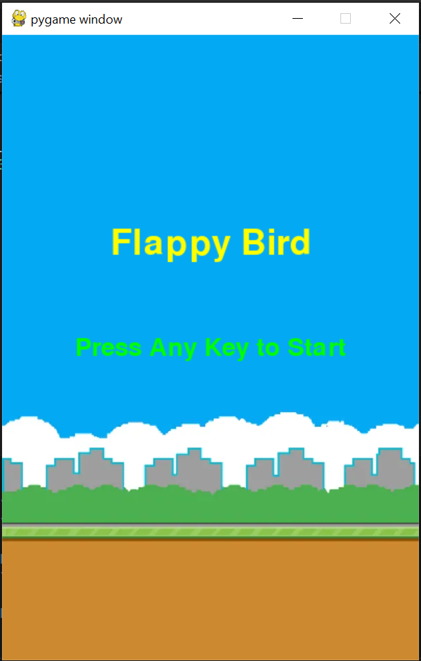
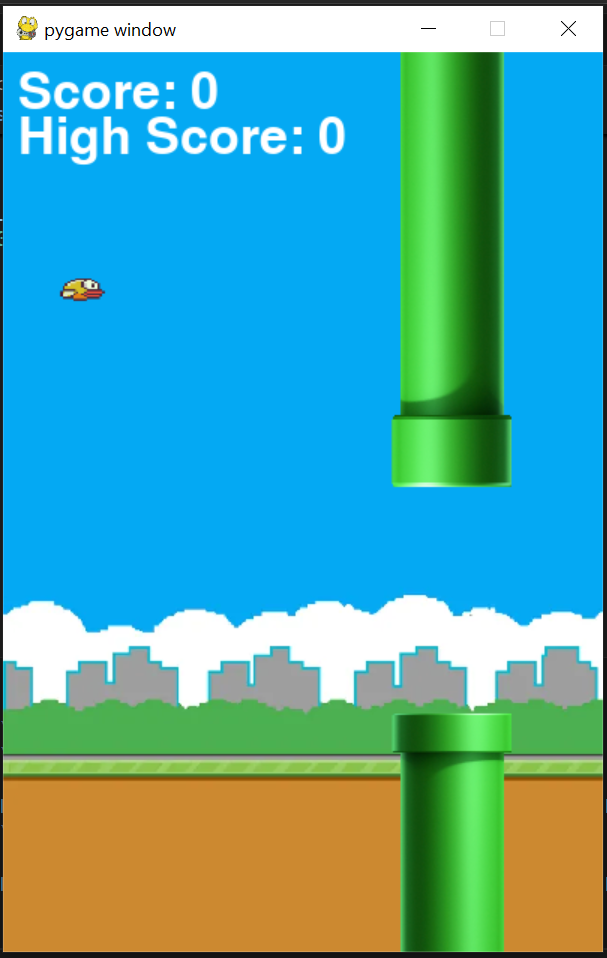
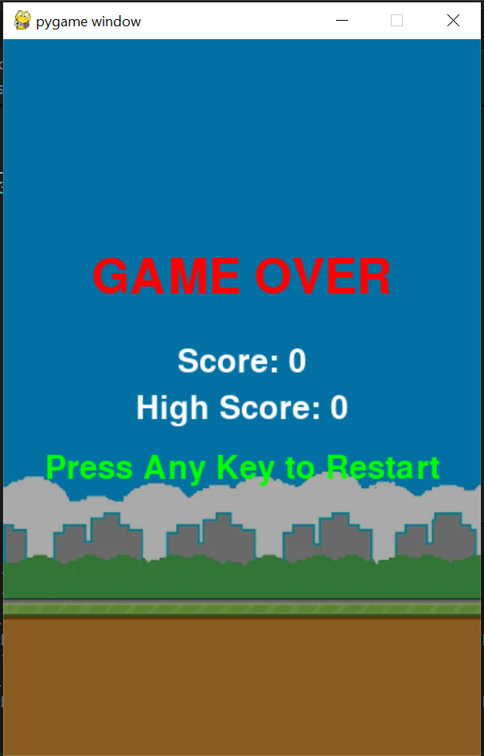

# Flappy Bird Clone - Python (Pygame)

A fully functional **Flappy Bird Clone** built with **Python** and **Pygame**. This game replicates the classic Flappy Bird mechanics, featuring **smooth animations, collision detection, scoring, and game over handling**.

---

### 🚀 Features
- **Press Any Key to Start** – The game doesn't start automatically, allowing players to prepare.
- **Realistic Bird Physics** – Gravity and jump mechanics for smooth movement.
- **Randomized Pipes** – Pipes generate at different heights to create a challenging experience.
- **Collision Detection** – Game ends when the bird hits a pipe or the ground.
- **Score & High Score Tracking** – Scores update dynamically, with the high score saved in a file.


---

### 🎮 Gameplay
1. **Launch the game** – The start screen will appear.
2. **Press any key** to begin the game.
3. **Control the bird** – Press the spacebar or any key to make the bird jump.
4. **Avoid the pipes** – The bird must pass through gaps without hitting the pipes.
5. **Score points** – The player gains points for successfully passing pipes.
6. **Game Over** – If the bird collides with a pipe or the ground, the game ends.
7. **Press any key to restart** – The game will reset and start over.

---

### 📥 Installation
#### 🔹 Prerequisites
- Python 3.x installed
- Pygame library installed

#### 🔹 Clone the Repository
```bash
git clone https://github.com/yourusername/flappy-bird-clone.git
cd flappy-bird-clone
```

#### 🔹 Install Dependencies
```bash
pip install -r requirements.txt
```

#### 🔹 Run the Game
```bash
python main.py
```

---

### 🖼️ Screenshots
| Start Screen  | In-Game  | Game Over  |
|--------------|---------|-----------|
|  |  |  |

---

### 🔧 Customization
#### 🔹 Change Gravity, Speed, or Pipe Gaps
Modify `config.py` to adjust gameplay difficulty.
```python
GRAVITY = 0.5      # Increase for faster falling
JUMP_STRENGTH = -8 # Decrease for lower jumps
PIPE_GAP = 150     # Increase for easier gameplay
PIPE_SPEED = 3     # Increase for a harder game
```

